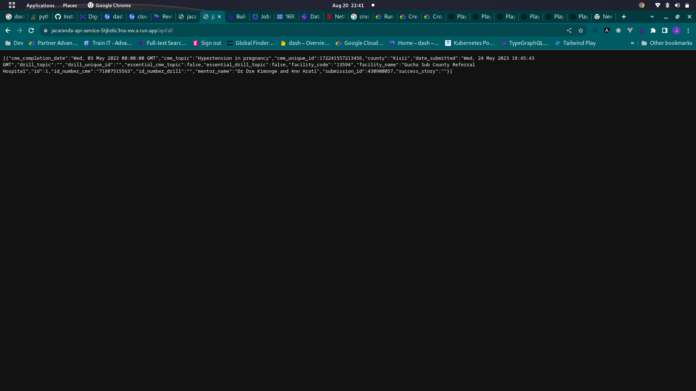
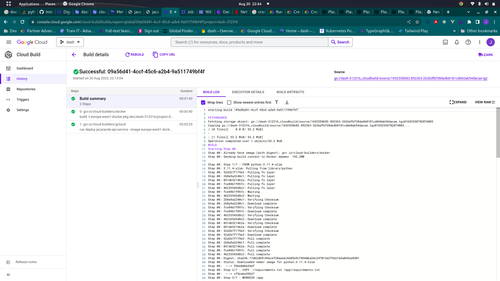
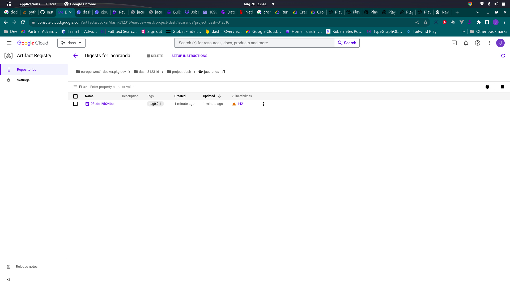
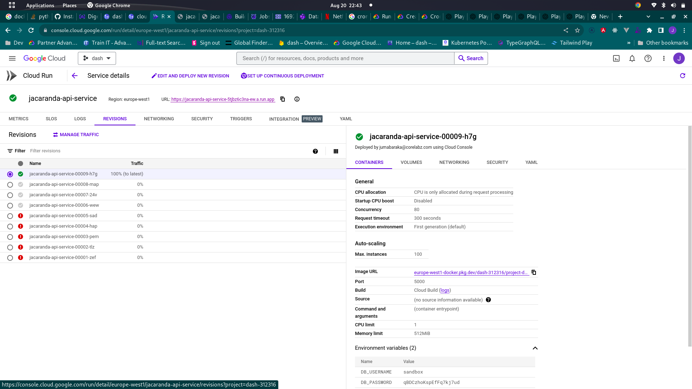
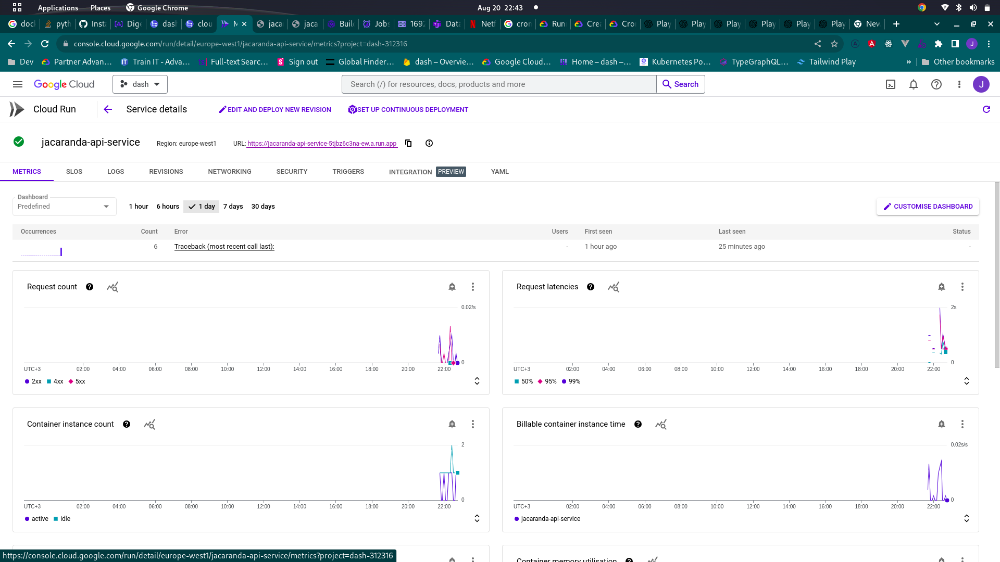
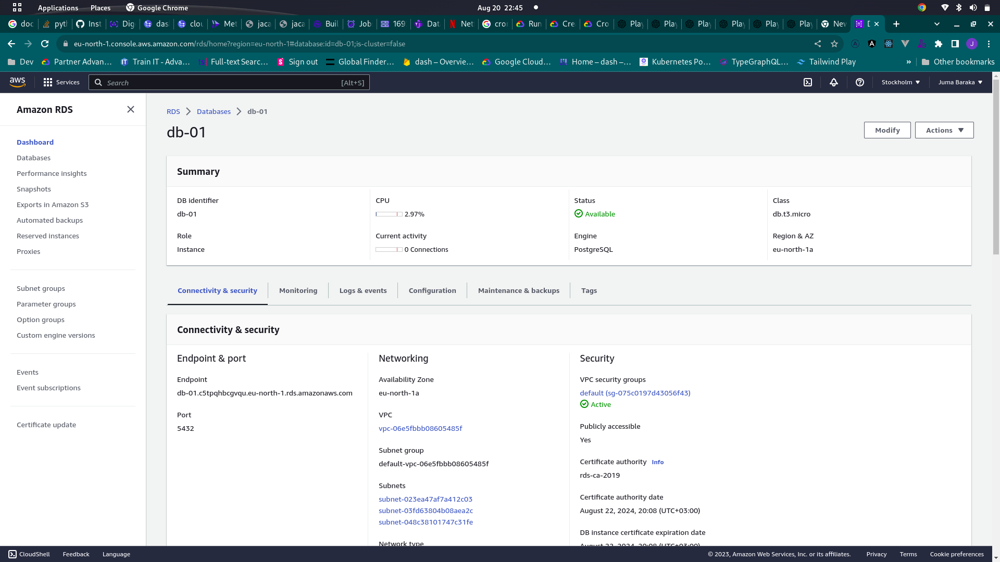
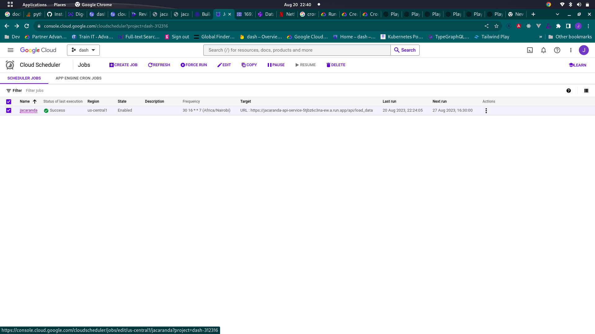

# Jacaranda Data Upload Api Service

## Api access

## To load data into the database, access the following URL:

```
https://jacaranda-api-service-5tjbz6c3na-ew.a.run.app/api/load_data
```

## To retrieve all the records from the database, access the following URL:

```
https://jacaranda-api-service-5tjbz6c3na-ew.a.run.app/api/all

```

# Screenshots

### Load data


### Retreive all data



### Building docker image (Cloud build)



### Stored docker image (Cloud Artifact)



### Jacaranda-are-service (Cloud run)





### Amazon RDS DB



## Cron job Scheduler by (cloud scheduler)



# Initial Setup

### Install the required dependencies:

- Install Python and pip.
- Install the psycopg2 library: `pip install psycopg2`.
- Install other dependencies: `pip install -r requirements.txt`

### Set the environment variables:

- Set the `DB_USERNAME` environment variable to the username for your PostgreSQL database.
- Set the `DB_PASSWORD` environment variable to the password for your PostgreSQL database.

[apps/api/mentors/init_db.py](apps/api/mentors/init_db.py)

## This mentor checklist database is hosted on Amazon RDS.

- Host: db-01.c5tpqhbcgvqu.eu-north-1.rds.amazonaws.com
- Database: postgres
- Username: [your provided username]
- Password: [your provided password]

Ensure that you have an active internet connection and the necessary permissions to access the Amazon RDS instance. Connect to the database using the provided host, database name, username, and password.

### Run the script:

- Make sure you have an active internet connection.
- Run the script in a Python environment.
- The script connects to the PostgreSQL database using the provided credentials and creates a table named `mentor_checklist`.
- If the table already exists, it will be dropped and recreated.

### Accessing the database:

- To access the created database, establish a connection to the PostgreSQL database using the provided host, database name, username, and password.
- Use the created cursor object to execute SQL queries on the `mentor_checklist` table.

### Understanding the table structure:

- The table `mentor_checklist` has the following columns:
  - `id` (BIGINT) - Primary Key
  - `cme_completion_date` (DATE)
  - `cmetopic` (TEXT)
  - `cme_unique_id` (BIGINT)
  - `county` (TEXT)
  - `date_submitted` (TIMESTAMP)
  - `drill_topic` (TEXT)
  - `drill_unique_id` (TEXT)
  - `essential_cme_topic` (BOOLEAN)
  - `essential_drill_topic` (BOOLEAN)
  - `facility_code` (TEXT)
  - `facility_name` (TEXT)
  - `id_number_cme` (TEXT)
  - `id_number_drill` (TEXT)
  - `mentor_name` (TEXT)
  - `submission_id` (BIGINT)
  - `success_story` (TEXT)

### Using the table:

- To insert data into the `mentor_checklist` table, execute an SQL INSERT statement using the cursor object.
- To retrieve data from the table, execute an SQL SELECT statement using the cursor object.
- Use the appropriate psycopg2 functions to fetch the data as needed.

Remember to securely manage your database credentials and connection details, as they contain sensitive information.

[apps/api/mentors/app.py](apps/api/mentors/app.py)

### `get_db_connection()`

```python
def get_db_connection():
  conn = psycopg2.connect(host="db-01.c5tpqhbcgvqu.eu-north-1.rds.amazonaws.com",
                            database="postgres",
                            user=os.environ['DB_USERNAME'],
                            password=os.environ['DB_PASSWORD'])
  return conn
```

This method establishes a connection to the PostgreSQL database using the provided host, database name, username, and password. It returns the database connection object.

### `load_data_from_sheet(sheet_name)`

```python
def load_data_from_sheet(sheet_name):
  # Load data from the specified sheet in the Excel file

  df = pd.read_excel('mentor_checklist.xlsx', sheet_name=sheet_name)
  # Fill empty cells with empty string
  df.fillna('', inplace=True)
  return df
```

This method reads data from the specified sheet in the Excel file (`mentor_checklist.xlsx`) using `pandas` library. It fills any empty cells with an empty string and returns the resulting dataframe.

### `transform_data(df)`

```python
def transform_data(df):
  # Rename the columns of the dataframe to match the table structure
  df.rename(columns={
    'ID': 'id',
    'CME Completion Date': 'cme_completion_date',
    'CME Topic': 'cme_topic',
    'CME Unique ID': 'cme_unique_id',
    'County': 'county',
    'Date Submitted': 'date_submitted',
    'Drill Topic': 'drill_topic',
    'Drill Unique ID': 'drill_unique_id',
    'Essential CME Topic': 'essential_cme_topic',
    'Essential Drill Topic': 'essential_drill_topic',
    'Facility Code': 'facility_code',
    'Facility Name': 'facility_name',
    'ID Number CME': 'id_number_cme',
    'ID Number Drill': 'id_number_drill',
    'Mentor Name': 'mentor_name',
    'Submission ID': 'submission_id',
    'Success Story': 'success_story'
  }, inplace=True)

   # Convert the date columns to proper date format
  df['cme_completion_date'] = pd.to_datetime(df['cme_completion_date'])
  df['date_submitted'] = pd.to_datetime(df['date_submitted'])

  # Transform the data to fit into the table structure
  transformed_df = df[[
    'id', 'cme_completion_date', 'cme_topic', 'cme_unique_id', 'county', 'date_submitted', 'drill_topic',
    'drill_unique_id', 'essential_cme_topic', 'essential_drill_topic', 'facility_code', 'facility_name',
    'id_number_cme', 'id_number_drill', 'mentor_name', 'submission_id', 'success_story'
  ]]

  return transformed_df
```

In the `transform_data` method, we pass the data obtained from the `load_data_from_sheet` method and transform it to match the structure of the `mentor_checklist` table in the database. The method performs the following steps:

1. Renames the columns of the dataframe to match the table structure.
2. Converts the date columns to the proper date format.
3. Selects the required columns in the desired order.
4. Returns the transformed dataframe.

### `load_data_to_db(data)`

```python
def load_data_to_db(data):
  # Connect to the PostgreSQL database
  conn = get_db_connection()

  # Create a cursor
  cursor = conn.cursor()

  # Prepare the insert statement
  insert_query = """
    INSERT INTO mentor_checklist (
        id, cme_completion_date, cme_topic, cme_unique_id, county, date_submitted, drill_topic,
        drill_unique_id, essential_cme_topic, essential_drill_topic, facility_code, facility_name,
        id_number_cme, id_number_drill, mentor_name, submission_id, success_story
    ) VALUES (
      %s, %s, %s, %s, %s, %s, %s, %s, %s, %s, %s, %s, %s, %s, %s, %s, %s
    )
  """
  # Load the data into the table
  for row in data.itertuples(index=False):
    values = (
      row.id, row.cme_completion_date, row.cme_topic, row.cme_unique_id, row.county, row.date_submitted,
      row.drill_topic, row.drill_unique_id, row.essential_cme_topic, row.essential_drill_topic,
      row.facility_code, row.facility_name, row.id_number_cme, row.id_number_drill, row.mentor_name,
      row.submission_id, row.success_story
    )

    # Check if the record already exists in the table based on the id
    select_query = "SELECT COUNT(*) FROM mentor_checklist WHERE id = %s"
    cursor.execute(select_query, (row.id,))
    result = cursor.fetchone()[0]
    if result == 0:  # If record does not exist, insert it into the table
      cursor.execute(insert_query, values)

  # Commit the changes
  conn.commit()

  # Close the cursor and connection
  cursor.close()
  conn.close()
```

In the `load_data_to_db` method, we pass the transformed data and load it into the PostgreSQL database. The method performs the following steps:

1. Connects to the PostgreSQL database using the `get_db_connection` method.
2. Creates a cursor object to execute SQL queries.
3. Prepares the `INSERT` statement for inserting a single row into the `mentor_checklist` table.
4. Iterates over each row in the transformed data and inserts it into the table if the record does not already exist.
5. Commits the changes to the database.
6. Closes the cursor and connection.

### `load_data()`

```python
@app.route('/api/load_data', methods=['GET'])
def load_data():
  # Load the data from the Google Sheets
  data = load_data_from_sheet("Test Data")

  # Transform the data
  transformed_data = transform_data(data)

  # Load the transformed data into the database
  load
```

The `load_data()` function is a Flask API route that handles the `/api/load_data` endpoint. It performs the following steps:

1. Calls the `load_data_from_sheet()` function to load the data from the "Test Data" sheet in the Excel file.
2. Calls the `transform_data()` function to transform the data to match the table structure.
3. Calls the `load_data_to_db()` function to load the transformed data into the database.
4. Returns a JSON response with a success message.

### `get_all_records()`

```python
@app.route('/api/all', methods=['GET'])
def get_all_records():
  # Connect to the PostgreSQL database
  conn = get_db_connection()

  # Create a cursor
  cursor = conn.cursor()

  # Execute the select query
  select_query = "SELECT * FROM mentor_checklist"
  cursor.execute(select_query)

  # Fetch all rows
  rows = cursor.fetchall()

  # Close the cursor and connection
  cursor.close()
  conn.close()

  # Convert rows to list of dictionaries
  columns = [desc[0] for desc in cursor.description]
  result = [dict(zip(columns, row)) for row in rows]

  # Return the result as JSON response
```

## To load data into the database, access the following URL:

```
https://jacaranda-api-service-5tjbz6c3na-ew.a.run.app/api/load_data
```

This will load the data from the "Test Data" sheet in the Excel file (`mentor_checklist.xlsx`), transform it, and insert it into the database.

## To retrieve all the records from the database, access the following URL:

```
https://jacaranda-api-service-5tjbz6c3na-ew.a.run.app/api/all
```

This will return all the records in the database as a JSON response.

# Deployment

## Dockerfile

[apps/api/mentors/Dockerfile](apps/api/mentors/Dockerfile)

```docker
# start by pulling the python image

FROM python:3.11.4-slim

# copy the requirements file into the image

COPY ./requirements.txt /app/requirements.txt

# switch working directory

WORKDIR /app

# install the dependencies and packages in the requirements file

RUN pip install -r requirements.txt

# copy every content from the local file to the image

COPY . /app

# Expose the required port

EXPOSE 5000

# Start the Flask application

CMD [ "flask", "run","--host","0.0.0.0","--port","5000"]

```

## Build the docker image in GCP Cloud Build and deploying to Cloud run

[apps/api/mentors/cloudbuild.yaml](apps/api/mentors/cloudbuild.yaml)

```

steps:
- name: 'gcr.io/cloud-builders/docker'
  args: [ 'build', '-t', 'europe-west1-docker.pkg.dev/$PROJECT_ID/project-dash/jacaranda:tag0.0.1', '.' ]

- name: 'gcr.io/cloud-builders/gcloud'
  args: ['run', 'deploy', 'jacaranda-api-service', '--image', 'europe-west1-docker.pkg.dev/$PROJECT_ID/project-dash/jacaranda:tag0.0.1', '--region', 'europe-west1']

images:
- 'europe-west1-docker.pkg.dev/$PROJECT_ID/project-dash/jacaranda:tag0.0.1'

```

## Build the Docker image, push it to cloud artifact then deploy to cloud run:

```
gcloud builds submit --config cloudbuild.yaml.
```

## Cron job

I am using Cloud Scheduler

